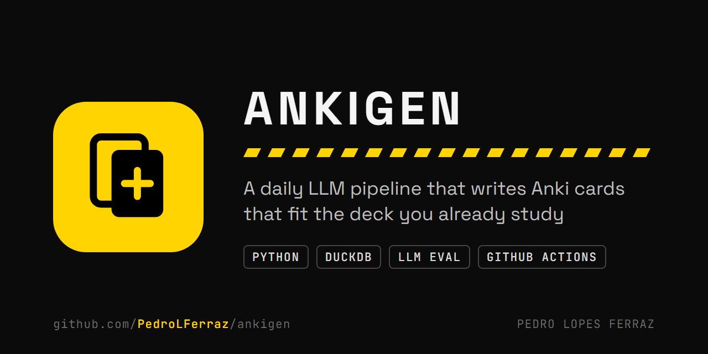
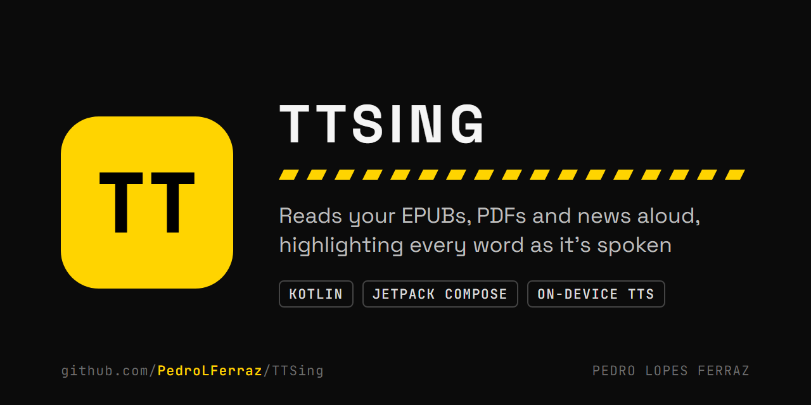

I'm a data scientist at BTG Pactual, working on machine learning in production: pipelines,
real-time APIs and LLM evaluation on AWS. M.Sc. from TU Darmstadt.

Outside work I build tools I use myself.

  
  

- **[AnkiGen](https://github.com/PedroLFerraz/ankigen)**: every morning a GitHub Actions run syncs my Anki
  collection, writes the day's cards with one LLM, fact-checks them with a second, drops what I already
  know by embedding similarity, and syncs the rest back to my phone. Idempotent stages over a DuckDB
  warehouse, with an Airflow DAG for the same stages.
- **[TTSing](https://github.com/PedroLFerraz/TTSing)**: an Android reader for books, PDFs and news that
  highlights each word as it's spoken, with neural voices that run on the phone. Kotlin and Jetpack Compose.

[LinkedIn](https://www.linkedin.com/in/pedro-lopes-ferraz)
